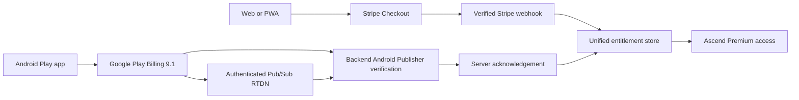

# Ascend Google Play Billing and Isolated Staging Handoff

Full evidence is in `docs/ASCEND_PLAY_BILLING_STAGING_EXECUTION_REPORT_2026-08-15.md`.

## Current checkpoint

- Branch: `codex/ascend-staging-play-billing-v1`
- Original checkpoint: `a32c47491dec3cf21c0b587e4d8a96a908bbe0f2`
- Current verified source before this documentation update: `f2bd39ef55daefd3a69c219f60a37a909a05f937`
- Production: unchanged
- Play product: `ascend_premium_monthly` / `monthly`, active for Malaysia only
- AAB: not generated or uploaded

## Working staging services

- Frontend: `https://ascend-frontend-staging-ascend-play-billing-staging.up.railway.app`
- Backend: `https://ascend-backend-staging-ascend-play-billing-staging.up.railway.app`
- Firebase project: `gen-lang-client-0096825107`
- R2 bucket: `ascend-staging-media`
- Gemini model: `gemini-3.6-flash`
- PostgreSQL: isolated Railway service with migrations 001-027

The frontend has a persistent staging banner and search-engine exclusion. Authenticated synthetic-user tests cover Firebase provisioning, `/me`, Food AI, R2 upload, food-log attachment, signed download, cross-user denial, and malformed input rejection.

## Billing flow

Web Stripe remains intact. Android hosted Stripe actions are hidden. Google Play purchase state is never trusted from the client. Pending purchases do not grant access.

## Pricing checkpoint

Recommended first closed-test product:

| Product | Base plan | Period | Proposed price | Status |
| --- | --- | --- | --- | --- |
| `ascend_premium_monthly` | `monthly` | P1M | RM19.99 | Active, Malaysia only |
| `ascend_premium_yearly` | `yearly` | P1Y | Not approved | Do not create |

The monthly plan has no trial, a seven-day grace period, automatic account hold, and resubscribe enabled. Google Play displays MYR 19.99 after Malaysia tax handling. The yearly plan remains deferred.

## Provider readiness

- The staging Play service account is active, app-scoped, and least privilege.
- Android Publisher API access is enabled and a live subscription-product read
  returned HTTP 200.
- Pub/Sub RTDN is configured with a dedicated topic, authenticated push
  subscription, keyless OIDC service account, and exact webhook audience.
- A Play Console test notification reached the staging webhook with HTTP 204 in
  116 ms.
- The `Ascend Internal Testers` licence-testing list is enabled with 10 users and
  normal licence responses.
- Required Railway billing and RTDN variables are set. The local downloaded Google
  JSON key was deleted after its secret value was securely stored and verified.
- External monitoring remains optional and is not connected.

## AAB and upload gate

The product, tester, Developer API, and RTDN prerequisites are ready. Before any
upload, build and inspect a staging-connected signed AAB for production URLs,
production Firebase/R2/Gemini identifiers, Stripe live configuration, secrets,
debug flags, and unsafe fallback values.

After all checks pass, report the AAB path, checksum, version, package, signing
evidence, environment scan, staging health, product readiness, RTDN readiness, and
rollback plan. Upload requires one explicit owner approval and must target only the
existing Closed Alpha track. The first uploaded build must then complete the full
sandbox purchase, renewal, cancellation, grace, hold, expiry, refund/revocation,
restore, and duplicate-event test matrix before any production recommendation.

## Rollback

Delete the isolated Railway environment, revoke staging Google/R2 credentials, remove staging provider resources, and delete the branch. Production needs no rollback because it was not changed.
