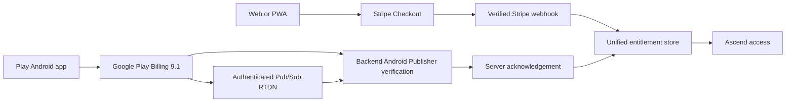

# Ascend Google Play Billing and Isolated Staging Handoff

Full execution evidence and release decisions are recorded in `docs/ASCEND_PLAY_BILLING_STAGING_EXECUTION_REPORT_2026-08-15.md`.

## Safety boundary

- Source RC: `d92d02b213fd7e8aa353a563b664b533cbae3da1`
- Branch: `codex/ascend-staging-play-billing-v1`
- Worktree: `C:\Users\Admin\Documents\Codex\ascend-staging-play-billing-v1`
- Existing Play app/package/closed track are unchanged.
- Production Railway services, database, R2, Firebase, Stripe and Google Play releases were not modified.
- No Play product was created or activated, no AAB was uploaded, and no charge was attempted.

## Provider flow

Any verified active entitlement grants access. A Play purchase does not cancel Stripe, and a Stripe purchase does not cancel Play. Purchase tokens are SHA-256 referenced and AES-256-GCM encrypted at rest. Raw tokens are not returned to clients, persisted in audit payloads, or logged.

## Product configuration checkpoint

Ascend's current web catalogue has Premium at RM19.99 monthly and Trainer Pro at RM99.99 monthly. No approved yearly Premium price exists in the catalogue. Configuration support is present, but Play products remain intentionally uncreated pending owner approval.

| Proposed product | Base plan | Period | Existing web reference | Proposed Play price |
| --- | --- | --- | --- | --- |
| `ascend_premium_monthly` | `monthly` | P1M | RM19.99/month | Approval required (parity recommendation: RM19.99) |
| `ascend_premium_yearly` | `yearly` | P1Y | None | Approval required; do not infer from env defaults |

Recommendation: begin closed testing with monthly price parity and no trial. Add yearly only after a deliberate commercial decision. Google service fees reduce net proceeds; do not silently raise Android prices without approval.

## Staging isolation

Created Railway environment `ascend-play-billing-staging` inside the existing Ascend Railway project, with a new isolated PostgreSQL service. It contains no copied production services, variables or data. Backend staging startup fails when production markers are detected, live email/push is enabled, analytics/monitoring environment labels are wrong, or scheduled jobs are enabled.

Android staging release tasks fail when staging Firebase variables are missing or point at `ascend-b2850`. Frontend staging is `noindex`, displays a persistent staging banner, and supports an isolated Firebase auth proxy.

## Blocked external provisioning

Firebase creation stopped safely because the Google account has reached its project quota. A quota increase or an owner-approved new Google Cloud project is required before a separate Ascend staging Firebase project can be created. Because Firebase staging credentials do not exist, the staging frontend/backend services and staging AAB must not be deployed or produced yet.

Cloudflare R2 and Gemini staging provisioning were not attempted after this blocking dependency; neither should be shared with production. Monitoring remains application logging only; no paid monitoring service was purchased.

## Required staging environment

Backend must set `ASCEND_APP_ENV=staging`, `ASCEND_BILLING_CHANNEL=google_play`, staging-only database/Firebase/R2/Gemini values, `ANALYTICS_ENVIRONMENT=staging`, `MONITORING_ENVIRONMENT=staging`, delivery modes `disabled` or `capture`, and scheduled jobs disabled. Generate token encryption and account-obfuscation secrets independently; never copy production secrets.

Frontend must set `NEXT_PUBLIC_APP_ENV=staging`, staging API and Firebase values, and `NEXT_PUBLIC_ANDROID_PLAY_BILLING_ENABLED=true` only when Play products are active for license testers.

Android must set `ASCEND_ANDROID_APP_ENV=staging`, `ASCEND_ANDROID_BILLING_CHANNEL=google_play` (or `disabled` before product setup), staging server URL and all staging Firebase values.

## Test gates before upload

1. Provision isolated Firebase, R2 and Gemini resources.
2. Deploy branch-only staging frontend/backend and run migration 027 only on staging Postgres.
3. Verify staging signup, Google sign-in, logout, deletion, upload, AI and no outbound email/push.
4. Approve Play prices, create inactive products/base plans, then activate only for license testing.
5. Configure Play Developer API service account and Pub/Sub authenticated push to staging RTDN.
6. Build a signed staging AAB with a fresh version code and verify its embedded server URL/environment/channel.
7. Run purchase, pending, restore, renewal, cancel, grace, hold, recovery, expiry, refund/revoke, reinstall and cross-provider tests.
8. Verify Stripe web checkout/webhooks remain unchanged.
9. Obtain explicit upload approval before uploading to Closed testing - Alpha.

## Rollback

Delete the isolated Railway environment and its Postgres service, revoke staging-only Google/R2 credentials, disable Play products/RTDN, and delete the feature branch. No production rollback is required because production was not modified.
