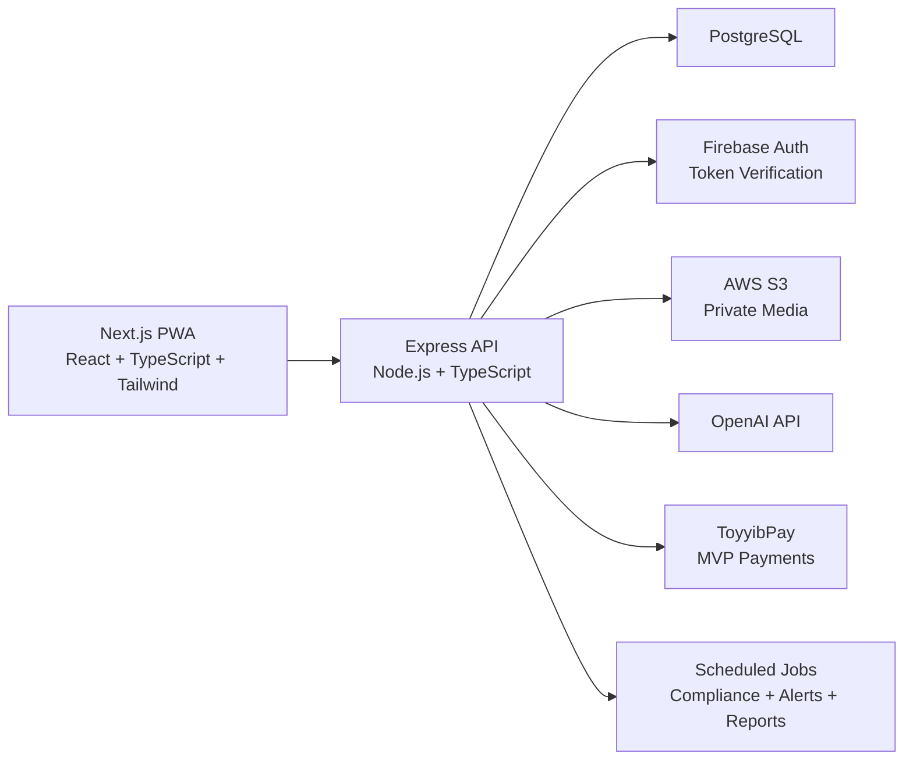

# Ascend Architecture And Implementation Roadmap

Ascend is a mobile-first, installable PWA SaaS for fitness accountability across unlimited gyms, trainers, and members. The MVP launches with Anytime Fitness Austin Green and Anytime Fitness Kulai Indahpura, with gym and trainer referral attribution built into the subscription and revenue model from day one.

## Approved Product Decisions

- Monorepo folders: `/frontend`, `/backend`, `/shared`.
- Firebase Auth is used for authentication only.
- PostgreSQL is the source of truth for users, roles, permissions, trainers, gyms, referrals, revenue attribution, subscriptions, compliance scores, and progress tracking.
- ToyyibPay is implemented first, behind a payment-provider abstraction so Stripe can be added later.
- The MVP is a mobile-first web SaaS and PWA.
- Multi-gym support is foundational, not a later extension.
- OpenAI integration is part of the MVP for food image analysis, AI nutrition coaching, and weekly summaries.

## System Architecture



## Clean Architecture

Backend layers:

- `domain`: business entities, constants, shared business logic.
- `application`: use cases such as onboarding, estimating meals, calculating compliance, creating checkout sessions.
- `infrastructure`: database, S3, Firebase, OpenAI, ToyyibPay.
- `interfaces/http`: routes, controllers, middleware, validators.
- `jobs`: scheduled work for compliance scores, risk alerts, and weekly reports.

Frontend layers:

- `app`: route groups for auth, client, trainer, and admin views.
- `components`: reusable UI primitives and feature components.
- `features`: role-specific modules.
- `lib`: API client, auth helpers, formatting, PWA helpers.
- `styles`: Tailwind and global styling.

Shared package:

- Shared TypeScript types.
- Role, plan, goal, compliance, and local food constants.
- DTO shapes used by both frontend and backend.

## Database Design

Core PostgreSQL tables:

- `gyms`
- `users`
- `user_roles`
- `trainers`
- `referral_codes`
- `subscriptions`
- `payment_events`
- `weight_logs`
- `water_logs`
- `food_logs`
- `progress_photos`
- `habits`
- `habit_logs`
- `compliance_scores`
- `risk_alerts`
- `messages`
- `ai_chat_messages`
- `weekly_reports`
- `analytics_events`
- `local_food_items`

The initial seed includes:

- Anytime Fitness Austin Green
- Anytime Fitness Kulai Indahpura
- Sample gym owner/admin
- Sample trainers
- Sample clients
- Trainer and gym referral codes
- Malaysia/Singapore food examples

## User Flows

### Client

1. Sign up with Firebase Auth.
2. Enter gym or trainer referral code.
3. Complete onboarding and goal setup.
4. Choose Free or Premium plan.
5. Use daily dashboard for weight, water, habits, food photos, and progress photos.
6. Ask the AI nutrition coach questions.
7. Receive weekly progress summaries.

### Trainer

1. Sign in.
2. View assigned clients.
3. Sort clients by compliance, risk, and recent activity.
4. Review food logs, weight trends, water logs, habits, and progress photos.
5. Receive risk alerts.
6. Generate weekly AI check-ins.
7. Message clients.

### Admin / Gym Owner

1. Manage gyms, trainers, clients, and assignments.
2. View subscriptions and revenue attribution.
3. Compare revenue by gym and trainer.
4. View usage and compliance analytics.
5. Manage referral codes.

## API Groups

All protected endpoints require:

```text
Authorization: Bearer <firebase_id_token>
```

API base:

```text
/api/v1
```

Endpoint groups:

- `/auth`
- `/me`
- `/gyms`
- `/trainers`
- `/admin`
- `/referrals`
- `/food-logs`
- `/weight-logs`
- `/water-logs`
- `/progress-photos`
- `/habits`
- `/compliance`
- `/risk-alerts`
- `/ai`
- `/subscriptions`
- `/webhooks/toyyibpay`
- `/webhooks/stripe`
- `/analytics`

## Security Design

- Firebase validates identity.
- Backend validates Firebase ID tokens.
- PostgreSQL controls all roles and permissions.
- Role-based authorization is enforced server-side.
- Trainers can only access assigned clients.
- Gym owners can only access gym-scoped data unless elevated.
- S3 media is private and accessed through signed URLs.
- Payment state is updated only through verified provider callbacks.
- AI calls use minimal needed user context.
- Admin actions are logged.
- Rate limiting protects auth-adjacent, AI, and payment routes.

## Billing Design

Plans:

- Free: RM0, basic tracking.
- Premium: RM19/month, AI food logging, progress photos, AI coach, weekly summaries.
- Trainer Pro: RM99/month, trainer dashboard, alerts, AI check-ins.

ToyyibPay is the first provider. The backend exposes a generic `PaymentProvider` interface:

- `createCheckoutSession`
- `verifyWebhook`
- `mapWebhookToSubscriptionEvent`
- `cancelSubscription`

Stripe can later be added by implementing the same interface.

Revenue attribution is stored directly on subscriptions:

- `referred_by_gym_id`
- `referred_by_trainer_id`
- `referral_code_id`

## AI Design

MVP OpenAI use cases:

- Food image analysis.
- AI nutrition coach.
- Weekly progress summaries.

Food analysis prioritizes Malaysian and Singaporean foods such as Nasi Lemak, Chicken Rice, Mee Goreng, Roti Canai, Satay, Laksa, Char Kway Teow, Economy Rice, Teh Tarik, Briyani, Thosai, and Wanton Mee.

All AI food estimates are editable before saving.

## Compliance Design

Compliance score is 0-100:

- Food logging: 35 points.
- Weight logging: 25 points.
- Water tracking: 20 points.
- Habit completion: 20 points.

Risk alerts are generated for:

- Inactive for 7 days.
- Compliance below 50.
- No food logs for 3 days.
- Weight trend moving away from goal.

## PWA Design

The frontend includes:

- Web app manifest.
- Service worker.
- Mobile-safe layout.
- Installable app metadata.
- Offline-friendly shell.
- Touch-first navigation.

## Deployment Architecture

Recommended MVP deployment:

- DigitalOcean App Platform or Docker Droplet for frontend/backend.
- DigitalOcean Managed PostgreSQL.
- AWS S3 for private media.
- Firebase Auth.
- OpenAI API.
- ToyyibPay.

Local development uses Docker Compose:

- `frontend`
- `backend`
- `postgres`

## Implementation Roadmap

### Phase 1: Foundation

- Create monorepo.
- Add shared types/constants.
- Add PostgreSQL schema and seed data.
- Add backend Express API.
- Add frontend Next.js PWA shell.

### Phase 2: Client MVP

- Onboarding.
- Daily dashboard.
- Weight logging.
- Water tracking.
- Habit tracking.
- Food image upload.
- AI food estimation.
- Editable food logs.
- Progress photos.
- AI coach.

### Phase 3: Trainer MVP

- Trainer dashboard.
- Assigned client list.
- Client profile.
- Food, weight, water, habit, photo review.
- Compliance score.
- Risk alerts.
- Weekly AI check-ins.
- Messaging.

### Phase 4: Admin MVP

- Manage gyms.
- Manage trainers.
- Manage users.
- Assign clients.
- Manage referrals.
- View subscriptions.
- Revenue by gym.
- Revenue by trainer.
- Usage and compliance analytics.

### Phase 5: Payments

- ToyyibPay checkout.
- ToyyibPay webhook.
- Subscription state sync.
- Plan gating.
- Revenue attribution.
- Stripe-ready provider interface.

### Phase 6: Production Readiness

- Automated tests.
- Docker setup.
- `.env.example`.
- README.
- Deployment guide.
- Smoke test checklist.
- Seed data.

